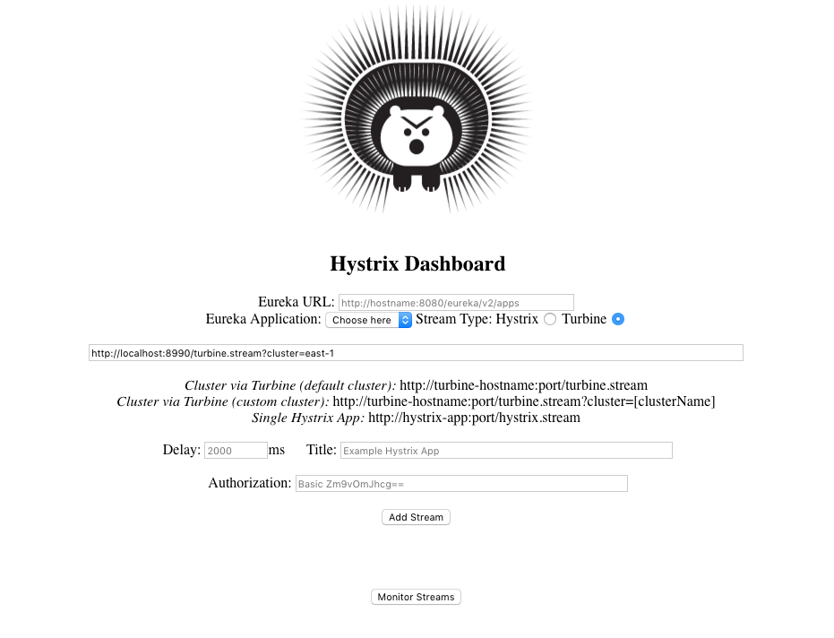

### Turbine Stream
[Turbine](https://github.com/netflix/Turbine) is a Netflix Project collecting [Hystrix](https://github.com/netflix/Hystrix) from multiple clients and merge them into one stream.

### Support Service Discovery
Clients can register their Hystrix stream to the Service Discovery like **Consul**, **Etcd**, **Zookeeper**, Turbine will load hystrix streams from it and merge them into one.

### Configuration

for example, you use **consul**, please set the configuration
**src/main/resources/application.yml**
```yml
spring:
  jmx:
    default-domain:
     localhost

spring:
  application:
    name: turbine

turbine:
  appConfig: east-1

spring:
  cloud:
    consul:
      host: consul
      port: 8500

server:
  port: 8990

```

### Hystrix Dashboard
Access the Hystrix Dashboard, **Add Stream** `http://localhost:8990/turbine.stream?cluster=east-1`

